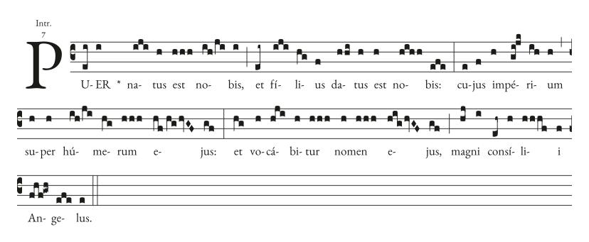
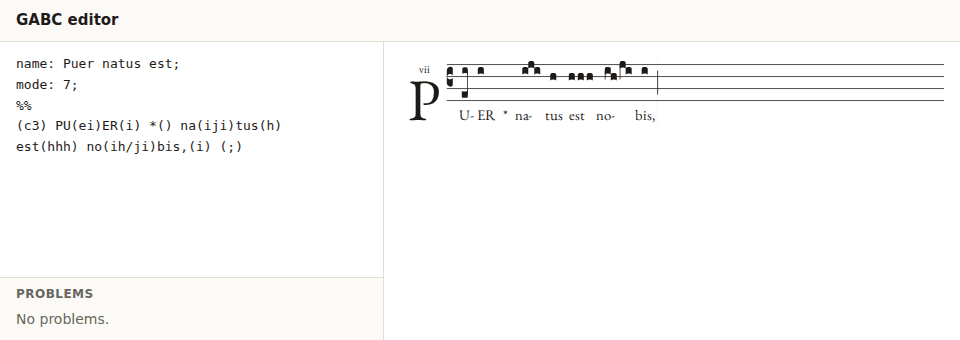
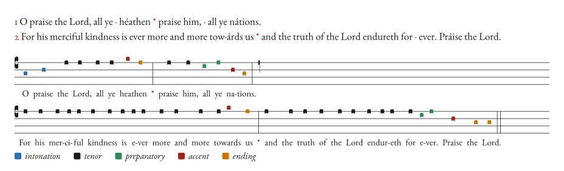
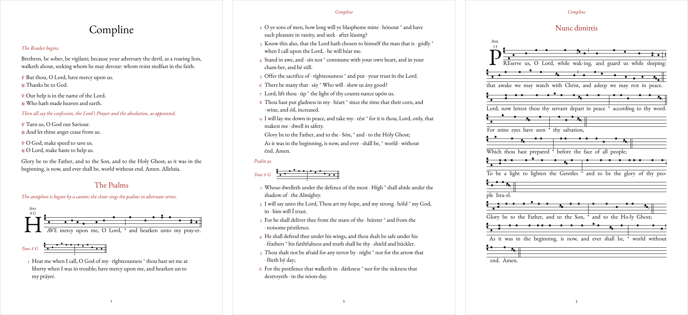

<p align="center">
  
</p>

# neuma

**Gregorian chant engraving for the web, servers and apps.** neuma reads
[GABC](https://gregorio-project.github.io/gabc/), the text format of the Gregorio project, and
engraves square notation in Gregorio's style that reflows to any width. It gives you SVG, a
renderer-neutral display list, and a timeline with the position, pitch and duration of every
note. It also sets English psalm text to the psalm tones, pointing it automatically, and
typesets whole booklets as PDF.

One Rust engine, with the same line breaks and coordinates on every platform:

| Use it from | How |
| --- | --- |
| **Rust** | the `neuma` crate (plus `neuma-tones` and `neuma-book`) |
| **The browser** | one dependency-free ES module with the engine inlined as WebAssembly |
| **iOS and Android** | Swift and Kotlin bindings generated with UniFFI |
| **The command line** | `neuma render`, `check`, `notes`, `info`, `psalm`, `point` and `book` |

It suits chant libraries and websites, daily office and hymnal apps, teaching and practice
tools, editors, and print.

> [!NOTE]
> neuma is in early development (0.1). The API may still change, and it isn't on crates.io or
> npm yet: use it from git (see [Quick start](#quick-start)).

**Contents:** [Features](#features) · [Quick start](#quick-start) · [Tour](#tour) ·
[Crates](#crates) · [Status](#status-and-roadmap) · [Contributing](#contributing) ·
[License](#license)

## Features

- **Gregorio's look.** Drop-cap initials with annotations, lyrics centred on the vowel,
  Gregorio's spacing and hyphenation, custodes, bars and clef changes, episemata, morae,
  liquescents, quilismas and the other neume shapes. Over a sample of 27 scores, set with the
  same font and staff size, neuma needs 170 lines where Gregorio needs 173.
- **Engrave once, reflow cheaply.** Parsing and neume construction happen once; only line
  breaking reruns when the width changes, so a page can relayout on every resize.
- **Never fails on input.** Malformed GABC returns diagnostics with stable codes, source
  spans and, where one edit makes sense, a fix. The engine draws what it can.
- **Built for editors.** A source map links each note, bar and syllable to its GABC both
  ways, and SVG can come a line at a time so a page redraws only what changed.
- **A timeline of every note,** with its position, pitch in semitones, duration weight,
  syllable and source span, to drive cursors, playback and practice tools.
- **Psalm tones from plain text.** Give it a psalm and a tone; it points each half-verse
  (marking the accents and the start of the cadence), says how sure it is, and sets it as
  chant.
- **Print booklets.** A short text file lists scores, psalms, rubrics and readings; neuma
  paginates them into a PDF and SVG pages.
- **Library entries** without engraving: typed headers, mode, incipit, text for search, range
  and length.

## Quick start

### Rust

```toml
[dependencies]
neuma = { git = "https://github.com/orthodoxwest/neuma" }
```

```rust
use neuma::Chant;

let gabc = "name: Regina caeli;\nmode: 6;\n%%\n\
    (c4) RE(f)gí(g)na(h) cae(hj)li,(h) lae(ghg)tá(fe)re,(f.) (;) al(f)le(g)lú(hg)ia.(g.) (::)";

// Parsing never fails: problems come back as diagnostics.
let chant = Chant::new(gabc); // engraved once; keep it, share it: it is Send + Sync
for d in chant.diagnostics() {
    eprintln!("{d}");
}

// Lay out at any width: cheap enough for every resize. A layout is an owned value.
let layout = chant.layout(720.0);
let svg = layout.svg(); // lyrics set in EB Garamond
let timeline = layout.timeline(); // where and when each note is
assert!(svg.starts_with("<svg") && timeline.notes.len() == 17);
let first = &timeline.notes[0];
assert_eq!(layout.note_at(first.cx, first.cy), Some(first.id)); // hit tests, per layout
```

Options are built with `with_*` setters
(`ChantOptions::default().with_initial(Initial::Lines(2))`,
`LayoutOptions::default().with_scale(8.0)`) and passed to the `_with` form of each call:
`Chant::with_options`, `chant.layout_with(width, &options)`, `layout.svg_with(&svg_options)`,
`layout.timeline_with(&weights)`.

### Browser

Build the module (it lands in `crates/neuma-wasm/dist/neuma.mjs`; CI also keeps each build
as the `neuma-browser` artifact):

```sh
cargo build -p neuma-wasm --target wasm32-unknown-unknown --profile wasm
node crates/neuma-wasm/build.mjs      # optionally: node crates/neuma-wasm/build.mjs path/to/wasm-opt
```

```js
import { init, Chant } from "./neuma.mjs";

await init(); // once; every call after this is synchronous

const chant = new Chant(gabc);
for (const d of chant.diagnostics) console.warn(`${d.code}: ${d.message}`);

const view = chant.view(); // where the score is shown; it frees the pages it replaces
const draw = () => { host.innerHTML = view.layout(host.clientWidth).svg; };
draw();
addEventListener("resize", draw); // a new layout for each width is cheap
host.addEventListener("click", (e) => console.log(view.page.noteAt(e.offsetX, e.offsetY))); // a note id
```

The module fetches nothing (it works inside sandboxed pages), and lyrics are spaced for
EB Garamond from Google Fonts: load `family=EB+Garamond:ital@0;1` on the page. See
[crates/neuma-wasm](crates/neuma-wasm/README.md) for the whole API.

### iOS and Android

```swift
let chant = Chant(gabc: source, options: ChantOptions())
let layout = chant.layout(width: Float(bounds.width), options: LayoutOptions())
// layout.page().items: glyphs (outlines from glyphOutline(id:)), rectangles and text to draw;
// layout.timeline(weights:): when each note sounds; layout.noteAt(x:y:) hit-tests a tap.
chant.update(src: edited) // after an edit: only what changed is engraved again
```

```kotlin
val chant = Chant(source, ChantOptions())
val page = chant.layout(widthPx, LayoutOptions(scale = 8f)).page()
```

Build the native libraries and generate the bindings as
[crates/neuma-mobile](crates/neuma-mobile/README.md) describes.

### Command line

```sh
cargo install --git https://github.com/orthodoxwest/neuma neuma-cli

neuma render --width 720 score.gabc > score.svg
neuma check *.gabc                # diagnostics; exits 1 on errors
```

## Tour

### Engraving that reflows

<p align="center">
  
</p>

A `Chant` does the expensive, width-independent work once, when it is made or updated:
neumes, glyphs, lyrics measured against the font, vowel centring and spacing. `layout` only
breaks lines
(into the fewest lines that fit, as GregorioTeX does), places clefs and custodes, and
justifies. It is cheap enough to call on every resize, rotation or text-size change.

A layout comes out in three forms:

- **SVG**, every fill `currentColor` and every element tagged with its role (`neuma-note`,
  `neuma-staff`, `neuma-rubric`, …), so CSS themes it, dark mode included.
- **A display list** of glyphs, rectangles and text runs in output units, for native canvases.
  Glyph outlines are plain `M L C Z` path data.
- **A timeline** (`layout.timeline()`), below.

Every position is in output units (staff spaces times the layout's `scale`, 6 by default)
from the layout's top left, with y down. Boxes are `x, y, w, h` from their top-left corner;
the one point that is a center, a timeline note's notehead, is named `cx, cy`.

```rust
use neuma::{Chant, ChantOptions, Initial, Item};

let gabc = "(c4) Al(f)le(gf)lú(gh)ia.(g.) (::)";
let chant = Chant::with_options(gabc, ChantOptions::default().with_initial(Initial::Lines(2)));

for width in [800.0, 400.0] {
    let list = chant.layout(width).display();
    for item in &list.items {
        match item {
            Item::Glyph { glyph, x, y, scale, .. } => {
                let path = neuma::glyph_outline(*glyph).unwrap().d; // fill at (x, y), scaled
            }
            Item::Rect { x, y, w, h, .. } => {} // staff and ledger lines, stems, bars, episemata
            Item::Text { x, baseline, size, runs, .. } => {} // lyrics, the initial, annotations
            _ => {}                                          // kinds added later
        }
    }
}
```

For a GABC editor, `chant.update(&source)` engraves again only around the edit, the next
layout reuses the line breaks it can, and `layout.svg_parts_reusing(&shown, &options)` reuses
each line's SVG that the page already shows. Each layout links itself and the source both
ways: `layout.source_at(x, y)`, `layout.note_at(x, y)`, and `layout.elements_at(byte)` or
`layout.elements_at_utf16(caret)` for a caret counted in UTF-16 units.

### Live editing in the browser

<p align="center">
  
</p>

The [example editor](crates/neuma-wasm/examples/editor.html) is one HTML file with no
dependencies. It redraws the score on each keystroke, replacing only the lines whose SVG
changed, underlines diagnostics with their messages and one-click fixes, selects the source of
whatever you click in the score, and highlights the note under the caret. The same calls fit
CodeMirror's lint and update listeners.

```js
const chant = new Chant(textarea.value);
const view = chant.view();
let page = view.layout(host.clientWidth); // a page answers its own clicks
textarea.addEventListener("input", () => {
  chant.update(textarea.value); // keeps the options; diagnostics follow the new source
  page = view.layout(host.clientWidth); // a new page, or the same if nothing changed
  host.innerHTML = page.svg;
  showProblems(chant.diagnostics); // { severity, code, message, utf16Start, utf16End, fix }
});
host.addEventListener("click", (e) => {
  const box = host.getBoundingClientRect();
  const hit = page.sourceAt(e.clientX - box.left, e.clientY - box.top); // note, bar or syllable
  if (hit) textarea.setSelectionRange(hit.utf16Start, hit.utf16End);
});
```

To try it, build the browser module, serve the repository root over HTTP and open
`crates/neuma-wasm/examples/editor.html`. Every diagnostic code is listed in
[docs/diagnostics.md](docs/diagnostics.md).

### A timeline of every note

<p align="center">
  
</p>

Each note in the timeline has an id, its notehead's position and size, its line, syllable and
word, its pitch (`semitones` above the clef's do, flats applied), and a `start` and
`duration` in weight units, with pauses for the bars. Weights are yours to set: one pulse a
note and two for a dotted note by default. Each piece of ink in the SVG lists its notes in
`data-note`, so following along is a few lines:

```js
import { noteAtTime } from "./neuma.mjs";

const page = chant.layout(host.clientWidth);
host.innerHTML = page.svg;
const timeline = page.timeline(); // made on the first call
const { notes, duration } = timeline;

const secondsPerPulse = 0.35;
const t0 = performance.now();
requestAnimationFrame(function tick(now) {
  const t = (now - t0) / 1000 / secondsPerPulse;
  host.querySelectorAll(".sung").forEach((el) => el.classList.remove("sung"));
  const note = noteAtTime(timeline, t); // null during a pause
  if (note) {
    host.querySelectorAll(`[data-note~="${note.id}"]`).forEach((el) => el.classList.add("sung"));
  }
  if (t < duration) requestAnimationFrame(tick);
});
```

`page.noteAt(x, y)` answers the reverse question for a tap or a click. The timeline also
marks recitation, accents, the start of each syllable, and the verse and half-verse.

### Psalm tones and automatic pointing

<p align="center">
  
</p>

Give `neuma-tones` psalm text, one verse a line with the mediant marked `*`, and a tone. It
points each half-verse the way a hand-pointed psalter does, `·` where the cadence starts and
an acute on each accented syllable, then sets the text as chant. Every note knows its part in
the tone, for practice tools.

```rust
use neuma::ChantOptions;
use neuma_tones::{PsalmChant, PsalmOptions, Tone, ToneRole, point, psalm};

let tone = Tone::named("8.G").unwrap();
let text = "1 O praise the Lord, all ye heathen * praise him, all ye nations.\n\
             2 For his merciful kindness is ever more and more towards us * \
               and the truth of the Lord endureth for ever. Praise the Lord.";

let pointing = point(text, tone);
assert_eq!(
    pointing.text,
    "1 O praise the Lord, all ye · héathen * praise him, · all ye nátions.\n\
     2 For his merciful kindness is ever more and more tow·árds us * \
       and the truth of the Lord endureth for · ever. Práise the Lord.\n"
);
let sure = pointing.halves.iter().all(|h| h.confidence >= 0.8); // per half-verse, 0 to 1

let setting = psalm(text, tone, &PsalmOptions::default());
assert_eq!(setting.notes[0].role, ToneRole::Intonation);
// Engrave it with its spans in the psalm text, so a tapped note's source is its syllable
// in `text`, and the setting's diagnostics (such as `point::unsure`) are the chant's. Its
// `update` sets new text to the same tone, and `notes()` follow.
let chant = PsalmChant::new(text, tone, &PsalmOptions::default(), ChantOptions::default());
let first = &chant.layout(600.0).timeline().notes[0];
assert_eq!(&text[first.span.clone()], "O");
```

Hand-pointed text is kept as written, so a correction survives pointing again. The pointer is
a small linear model over lexical stress (from the CMU Pronouncing Dictionary) and the shape of
the cadence, fitted to a hand-pointed English psalter. On psalms held out from fitting it
agrees with the hand pointing on about 81% of half-verses; it is 80% sure or more of about 70%
of them, and those agree about 92% of the time. The ones below 80% come back as `point::unsure`
diagnostics to check. The Solesmes tones and their usual endings are built in, and a tone of
your own is a few lines of text. See [crates/neuma-tones](crates/neuma-tones/README.md).

More often a psalm is shown as a pointed psalter prints it, the tone once and the verses as
text. `Tone::gabc()` is the tone as one line of notes, `Tone::label()` its name ("Tone 8 G"),
and `PsalmDisplay` the verses pointed for it as runs of text to style, each syllable with its
place in the text and the tone:

<p align="center">
  
</p>

In the browser it is `point(text, "8.G")`, `psalm(text, "8.G")`,
`Chant.fromPsalm(text, "8.G")`, and `Chant.fromTone("8.G")` with `psalmDisplay(text, "8.G")`
(as in [examples/psalm.html](crates/neuma-wasm/examples/psalm.html)); on the command line,
`neuma point --tone 8.G psalm.txt` and `neuma psalm --tone 8.G psalm.txt | neuma render -`.

### Print booklets

<p align="center">
  <a href="docs/images/booklet.png"></a>
</p>

`neuma book` sets the chant of a service on fixed-size pages, as a PDF to print and one SVG
per page. The book is a plain text file:

```text
page: a5
initial: 1

title: Compline
rubric: The Reader begins.
text lines:
    V/ O God, make speed to save us.
    R/ O Lord, make haste to help us.
heading: The Psalms
score: have-mercy.gabc
psalm tone=8.G gloria: psalm-4.txt
heading: Nunc dimittis
psalm tone=3.a intone=every set=chant gloria: nunc-dimittis.txt
```

```sh
neuma book examples/compline/compline.book -o compline.pdf --svg pages/
```

Psalms can be printed pointed under their tone (as above), with the first verse in chant, or
in chant throughout. Pages keep a heading or rubric with what follows and an antiphon with its
psalm, and never leave one staff alone at a page break. The PDF embeds the text face, EB
Garamond 12 when it is installed or any TrueType or OpenType font you name, so its text can
be searched and copied; with no font it uses the standard Times faces every PDF viewer has. The whole example is in
[examples/compline](examples/compline/compline.book); the format is in
[crates/neuma-book](crates/neuma-book/README.md).

### iOS and Android

[`neuma-mobile`](crates/neuma-mobile/README.md) wraps the engine with UniFFI. A `Chant` is
thread-safe; `layout` returns a `ChantLayout`, whose `page()` has the items to draw (each
glyph's outline is fetched once with `glyphOutline`), whose `timeline(weights)` is the
browser's, and whose hit tests answer for it alone, so a thumbnail and the main view don't
mix. Close a layout when a new one replaces it: it holds the engraving it was drawn from.

```swift
let chant = Chant(gabc: source, options: ChantOptions())
let layout = chant.layout(width: Float(bounds.width), options: LayoutOptions())
for item in layout.page().items {
    switch item {
    case let .glyph(glyph, x, y, scale, _, _):
        fillGlyph(glyphOutline(id: glyph)!.path, x: x, y: y, scale: scale) // your drawing code
    case let .rect(x, y, w, h, _, _):
        fillRect(x: x, y: y, width: w, height: h)
    case let .text(x, baseline, size, runs, _, _):
        drawLyrics(runs.map { $0.text }.joined(), x: x, baseline: baseline, size: size)
    }
}
let tapped = layout.noteAt(x: Float(point.x), y: Float(point.y)) // a note id, or nil
```

```kotlin
val chant = Chant(source, ChantOptions())
val layout = chant.layout(width, LayoutOptions())
for (item in layout.page().items) when (item) {
    is Item.Glyph -> drawGlyph(glyphOutline(item.glyph)!!.path, item.x, item.y, item.scale)
    is Item.Rect -> drawRect(item.x, item.y, item.w, item.h)
    is Item.Text -> drawLyrics(item.runs.joinToString("") { it.text }, item.x, item.baseline, item.size)
}
val id = layout.noteAt(x, y) // the note under a tap, or null
layout.close()
chant.close()
```

The bindings also cover diagnostics with fixes, `sourceAt` and `elementsAt` for editors,
`setOptions` for a new text size, library entries and psalm tones (`Chant.fromPsalm`).

### Library entries

`summarize` reads a score's library entry without engraving it for display, cheap enough to
index a whole collection. It holds the headers (typed where they have a meaning, such as the
office part and mode), the incipit and the sung text for search, the range and final in
semitones (`lowest`, `highest`, `finalPitch`), and counts and length:

```console
$ neuma info crates/neuma/tests/golden/regina-caeli-simple.gabc | jq '{name, kind, mode: .mode.number, incipit, lowest, highest, notes, duration}'
{
  "name": "Regina caeli (simple tone)",
  "kind": "antiphon",
  "mode": 6,
  "incipit": "Regína caeli, laetáre,",
  "lowest": -8,
  "highest": 0,
  "notes": 47,
  "duration": 63
}
```

The same entry is `neuma::summarize` in Rust, `summarize(gabc)` in the browser and
`summarize(gabc:)` on mobile.

### Command line

```text
neuma render [--width PX] [--scale PX] [--initial LINES] [--max-lines N] FILE|-   SVG to stdout
neuma check FILE...                 diagnostics, with fixes; exits 1 on errors
neuma notes FILE                    the layout and timeline as JSON
neuma info FILE...                  one library entry per file, as JSON lines
neuma tones                         the built-in psalm tones
neuma point --tone TONE FILE        psalm text with pointing marks added
neuma psalm --tone TONE FILE        psalm text set to a tone, as GABC
neuma book FILE.book|- [-o OUT.pdf] [--svg DIR] [--text-as-paths]
neuma --help | --version
```

A file named `-` is stdin, and without a file every command but `tones` and `book` reads
stdin (`neuma book -` needs `-o`). `--` ends the options, for a file whose name starts with
`-`. `--help` and `--version` answer without reading stdin, after any command. Each command
takes only its own options (`neuma COMMAND --help` lists them). An unknown command or option,
an option without its value, or a width or scale out of range (a width above 0 and at most
1000000, a scale from 0.01 to 1000) is an error.

Diagnostics come one to a line as `FILE:LINE:COL: SEVERITY: CODE: MESSAGE`, with the fix, if
there is one, on the next line: from `neuma check` on stdout, in order of position, and from
`psalm`, `point` and `book` on stderr. `FILE` is `<stdin>` for stdin. In `neuma book` it is
a piece's own file, or the book for text written in it; a problem with a whole piece, such as
an unknown tone or a line past the margin, is at the piece's line in the book and names the
piece (`compline.book:12:1: error: book::psalm: piece 5 (psalm-4.txt): …`). Lines and columns count from 1, the column in
characters (Unicode scalar values, so a tab or an accented letter is one), not counting a
byte-order mark at the start of the file. The exit status is 1 when the input has errors and
2 for a usage error or a file that can't be read or written; output to a reader that stops
early, such as `head`, just ends.

```console
$ cat alleluia.gabc
name: Alleluia;
%%
(c4) Al-(f)le(gf)lú(gh)ia.(g.) (::)
$ neuma check alleluia.gabc
alleluia.gabc:3:8: warning: gabc::hyphen-in-syllable: a hyphen at the end of a syllable prints in addition to the hyphen the engine draws; remove it
    fix: Remove the hyphen
```

## Crates

| Crate | What it is |
| --- | --- |
| [`neuma`](crates/neuma) | The engine: GABC parser, engraving, layout, display list, SVG, timeline, source map and library entries. |
| [`neuma-tones`](crates/neuma-tones/README.md) | Psalm tones, pointed-text markup, English syllabification and the automatic pointer. |
| [`neuma-book`](crates/neuma-book/README.md) | Booklets: pagination, a PDF writer with font subsetting, and SVG pages. |
| [`neuma-wasm`](crates/neuma-wasm/README.md) | The browser module `neuma.mjs` and its example editor. |
| [`neuma-mobile`](crates/neuma-mobile/README.md) | UniFFI bindings for Swift and Kotlin. |
| [`neuma-cli`](crates/neuma-cli) | The `neuma` command. |
| [`neuma-metrics`](crates/neuma-metrics) | Builds the font metrics tables that lyrics are measured with. |

[docs/DESIGN.md](docs/DESIGN.md) describes the architecture and
[CHANGELOG.md](CHANGELOG.md) what has changed.

## Status and roadmap

neuma is young but already tested hard: golden snapshots of 22 reference scores, fuzzing
of the parser and layout, and a nightly run of every score in
[GregoBase](https://gregobase.selapa.net/) (about 18,800) through parsing, engraving, layout at
three widths, SVG and a GABC round trip. Next:

- publishing to crates.io and npm;
- reading tones, for collects and chapters;
- the open questions in [docs/DESIGN.md](docs/DESIGN.md#open-questions), such as vowel
  centring for English and a core SVG mode with text as outlines.

Out of scope: NABC (adiastematic neumes), polyphony, modern notation and staves other than four
lines.

## Contributing

Issues and pull requests are welcome. [CONTRIBUTING.md](CONTRIBUTING.md) has the checks CI
runs, how to update the golden snapshots, and how to fuzz and run the corpus.

## License

Licensed under either of

- Apache License, Version 2.0 ([LICENSE-APACHE](LICENSE-APACHE))
- MIT license ([LICENSE-MIT](LICENSE-MIT))

at your option.

Unless you explicitly state otherwise, any contribution intentionally submitted for inclusion
in the work by you, as defined in the Apache-2.0 license, shall be dual licensed as above,
without any additional terms or conditions.

## Acknowledgements

neuma stands on the work of others ([NOTICE](NOTICE) has the details and licenses):

- [exsurge](https://github.com/bbloomf/exsurge) (MIT): the glyph outlines and much of the neume
  construction are ported from it.
- The [Gregorio project](https://gregorio-project.github.io/): the GABC format, and the look
  and spacing neuma follows. neuma is written from Gregorio's documentation and uses none of
  its code.
- [EB Garamond](https://github.com/georgd/EB-Garamond) (SIL OFL 1.1): the lyric face, whose
  advance and kerning measurements ship with neuma (no outlines).
- [jgabc](https://github.com/bbloomf/jgabc) (public domain): the psalm tone formulas.
- The [CMU Pronouncing Dictionary](https://github.com/cmusphinx/cmudict): lexical stress for
  the pointer.
- Adobe's core-14 font metrics: widths of the standard Times faces, for booklets without a
  font file.

The images in this README are drawn by neuma itself; [tools/readme](tools/readme/README.md)
regenerates them.
