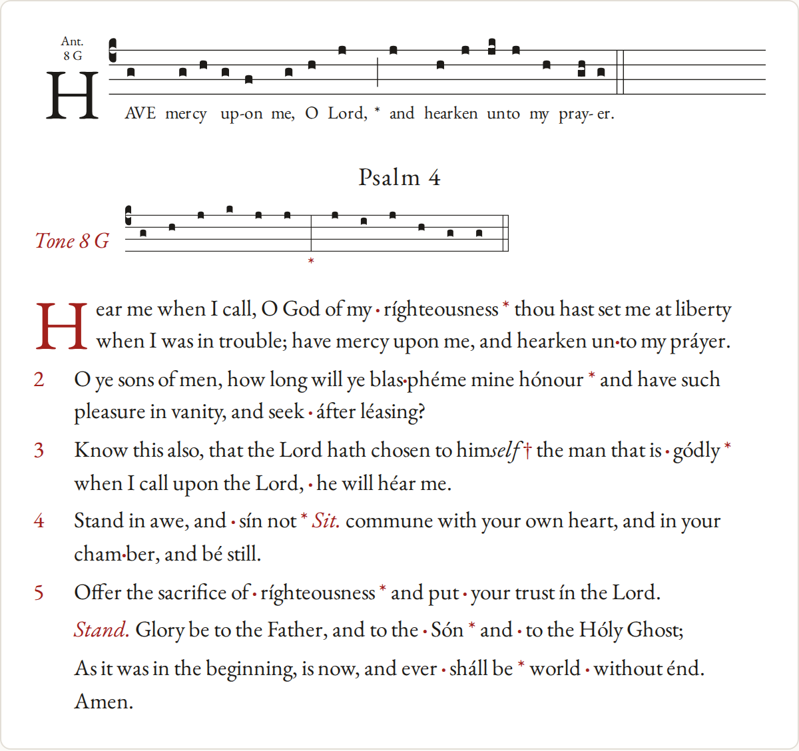

# neuma for the browser

One ES module, `dist/neuma.mjs`, with the engine inlined as gzipped WebAssembly (about
190 KB). It fetches nothing, so it works inside sandboxed pages that block other origins.

```sh
cargo build -p neuma-wasm --target wasm32-unknown-unknown --profile wasm
node crates/neuma-wasm/build.mjs path/to/wasm-opt   # wasm-opt is optional
node crates/neuma-wasm/test.mjs
```

CI builds the module on every push and keeps it as the `neuma-browser` artifact.

## Use

```js
import { init, Chant } from "./neuma.mjs";

await init();                      // once; everything after is synchronous
const chant = new Chant(gabc, { initial: 1, annotation: true });
chant.diagnostics;                 // [{ severity, start, end, utf16Start, utf16End, code, message, fix }]

const page = chant.layout(host.clientWidth, {
  scale: 6,                        // output units per staff space
  lastLine: "ragged",              // or "justified"
  maxLines: 0,                     // 1 for an incipit preview; 0 keeps every line
  weights: { mediant: 3, full: 2.5 },
});
host.innerHTML = page.svg;
```

The lyric font is EB Garamond. Load it on the page from Google Fonts
(`family=EB+Garamond:ital@0;1`), and the layout spaces lyrics with that font's metrics. A
page that serves the EB Garamond 12 files instead passes `{ font: "eb-garamond-12" }`. Leave
the SVG text's size, weight and letter-spacing alone: CSS that changes them changes the
widths the layout planned for.

`page` is a `Page`: `{ width, height, svg }`, its `timeline()`, made on the first call, and
its hit tests (below). Every position is in output units (staff spaces times `scale`, the
SVG's user units) from the layout's top left, with y down. A box is `x`, `y`, `w`, `h` from
its top-left corner; a point that is a center is named `cx`, `cy`.

A page answers for the score it shows for as long as it lives, whatever the chant has laid
out or become since: a thumbnail made with `maxLines: 1` leaves the main page's hit tests
alone, and after `chant.update` or `chant.setOptions` a page made before still answers for
the score it shows, so a click or a caret move between an edit and the next frame finds what
is on screen. `page.stale` is true once the chant has changed since the page was laid out:
lay out again to show the new score. `update` and `setOptions` return whether anything
changed, and `chant.version` names the chant's state (`page.version` is the chant's version
the page was laid out at): a number no other state of any chant has had, which grows with
each change, as in Rust and on mobile.

### Pages and memory

**A page always answers.** The engine keeps the layouts behind pages in a cache of the
most recently used: by default 4 across every chant, view and page, enough for an editor's
page and thumbnail, each with the one before. A page whose layout was dropped (because
newer ones pushed it out, or `page.free()`) lays itself out again the next time it is
asked, from what it was made from: its chant's source and options at the time, its width
and its weights. It gives the same answers, byte for byte. So no page throws for its age,
nor after its chant is freed or changed.

- `setLayoutBudget(count)` sets how many layouts the engine keeps. Each holds an
  engraving: under 200 KB for a typical score, about 4 MB for the longest (about 4,900
  notes), so the default stays near 45 MB of engine memory there however pages are made.
  Lower it for a phone. Raise it when many scores are shown and clicked at once: laying a
  page out again costs little while its chant hasn't changed, but a full layout once it
  has (tens of milliseconds on the longest scores). On the longest scores each layout kept
  also slows an edit a little (a few tenths of a millisecond), the memory touched growing.
- `engineStats()` returns `{ memory, layouts, budget }`: the WebAssembly memory's size in
  bytes (which only grows), the layouts held and the budget.
- `page.free()` and `chant.free()` drop the engine's copies now: hints, for when a page or
  a chant goes away. Both still work after it: a freed chant engraves its source again when
  used, as the same state, so its pages stay current. A `FinalizationRegistry` drops the
  copies of pages and chants that are garbage collected. For pages that only frees memory
  sooner, since the budget bounds their layouts without it; a chant's own engraving lives
  until it is freed or collected.

### Views: pages for a place that shows the score

A place that lays the score out again on every change, an editor's preview above all, does
it through a **view**:

```js
const view = chant.view({ svg: "lines", ids: false }); // the options but width and weights
let page = view.layout(host.clientWidth);               // on each change and each resize
```

- `view.layout(width, { weights })` returns the view's page for the chant as it is now. Asked
  again with the same width and weights, and no change to the chant, it returns the same
  page (as it does for the width before, so alternating two widths lays out nothing);
  otherwise a new one, made reusing the last page's lines (with `svg: "lines"`).
  `view.page` is the page it last gave.
- Give each place its own view (each panel, each component instance), so each reuses the
  lines of its own last page. `view.free()` drops the engine's copies of its pages.

`chant.layout(width, options)` makes a one-off page, a new one on each call: a static
rendering, a print, a thumbnail drawn once.

**Memory and time.** A page whose layout is held when the chant changes makes the update
copy the engraving rather than change it in place, and an editor always holds the page on
screen, so this copy is part of an edit's cost: on the longest scores about 1.7 ms of a 5 ms
update, on typical ones next to nothing.

- **`timeline.notes`**: one entry per note, in singing order, with these fields:
  - `id`: stable across layouts of one `Chant`. Each SVG element lists the notes it draws
    in `data-note`, so select a note's ink with `[data-note~="<id>"]`: a porrectus swash
    draws two notes and reads `data-note="4 5"`.
  - `cx`, `cy`: the notehead's center. `w`, `h`: its size. For a porrectus, the swash's
    two ends.
  - `line`, `syllable`, `word`.
  - `start`, `duration`: in weight units. Choose your own tempo.
  - `staffPosition`, `degree`, `semitones`: `semitones` counts from the clef's do, with
    flats applied.
  - `syllableText`, `vowel`, `shape` (`quilisma` among them), `liquescent`.
  - `accent`: the syllable has an acute in the source.
  - `newSyllable`: the first note of its syllable.
  - `recitation`: inferred from three or more single-note syllables on one pitch.
  - `verse`, `half`: `verse` advances after each full or double bar. `half` turns to 1 at
    the mediant `*`.
  - `sourceStart`, `sourceEnd`: the note's bytes in the GABC source;
    `sourceUtf16Start`, `sourceUtf16End`: the same in UTF-16 units.
- **`timeline.pauses`**: `{ beforeNote, kind, start, duration }`. `kind` is one of
  `virgula`, `minimis`, `quarter`, `half`, `full`, `dotted-full`, `double`, `dominican`,
  `mediant` (`*`) or `flex` (`†`). A mediant or flex is the whole pause at its bar: the bar
  right after it stays in the list with duration 0.
- **`timeline.lines`**: each line's `top`, `bottom`, `staff` (the middle line) and
  `baseline` (the lyrics).
- **`timeline.duration`**: the total length.

`noteAtTime(timeline, t)` returns the note sounding at time `t`, or `null` during a pause,
for a playhead that follows audio.

Offsets named `start` and `end` (and the timeline's `sourceStart` and `sourceEnd`) count
UTF-8 bytes of the source, as the engine does. Offsets named with `utf16` (`utf16Start`,
`utf16End`, `sourceUtf16Start`, `sourceUtf16End`), and the carets the editor calls take,
count UTF-16 code units: JavaScript string indices, as `textarea` and
CodeMirror use. They differ once the source has a character outside ASCII (`é`, `℣`).

Each diagnostic has a `code` that stays stable across versions (see
[docs/diagnostics.md](../../docs/diagnostics.md) for the list), a `message` for people, and a
`fix` that is `null` or the one edit that fixes it:
`{ start, end, utf16Start, utf16End, replacement, title }`, replacing
`utf16Start`..`utf16End` with `replacement`.

`page.noteAt(x, y)` returns the note under a point, or the nearest note on that line, or
`null`. `chant.setOptions({ lyricSize: 3 })` engraves again with new options (those the
constructor takes).

Weights default to `DEFAULT_WEIGHTS`: one pulse per note, two for a dotted note, and pauses
that grow with the bar. Any key you pass with a number overrides its default, except a negative one; no weight
goes above 1000.

If the engine ever stops on an internal error (a WebAssembly trap, or a `RangeError` for a
stack overflow), that call throws and so does every later one until you call `init()` again,
which starts a fresh engine. `Chant`s, views and pages made before carry on in it, engraved
again when next used.

## Editors

A `Chant` can back a GABC editor with a live preview: update it on each change, lay it out,
and link the source and the score both ways.

```js
const chant = new Chant(textarea.value, { initial: 1 });
const view = chant.view({ svg: "lines", ids: false });
let page = view.layout(host.clientWidth);
textarea.addEventListener("input", () => {
  chant.update(textarea.value);    // keeps the options; diagnostics follow the new source
  page = view.layout(host.clientWidth); // reuses the lines that didn't change
  // page.svgParts: { head, defs, rest, lines: [{ top, svg }] }
});
host.addEventListener("click", (e) => {
  // Layout coordinates from the score's top left: `offsetX`/`offsetY` would be relative to
  // whichever line's <svg> was clicked. If `host` scrolls or has a border, count them too.
  const box = host.getBoundingClientRect();
  const x = e.clientX - box.left - host.clientLeft + host.scrollLeft;
  const y = e.clientY - box.top - host.clientTop + host.scrollTop;
  const hit = page.sourceAt(x, y); // { kind, index, utf16Start, utf16End, x, y, w, h, cx, … }
  if (hit) textarea.setSelectionRange(hit.utf16Start, hit.utf16End);
});
const lit = page.elementsAt(textarea.selectionStart); // what to highlight for the caret
```

- **`chant.update(gabc)`** replaces the score, keeping the options, and returns whether it
  changed. Lay it out again to see it.
- **`page.timeline()`** is made only when called, so an editor that never reads it skips what on
  a long score is most of the layout's cost.
- **`{ svg: "lines" }`** gives `page.svgParts` instead of `page.svg`:
  `head` (the `<svg>` start tag and style), `defs` (the glyph `<path>`s, for a `<defs>`),
  `rest` (the initial and its annotations) and `lines`, each `{ top, svg }` with the line's
  elements positioned relative to its top. Wrap each in
  `<g transform="translate(0 top)">`. A line that only moved keeps its `svg` string, and with
  `ids: false` (no `data-note` or `data-syllable`) so does a line after notes added above it,
  so an editor can replace only the lines whose string changed. On a long score, replacing
  the whole SVG costs the browser far more than the engine's work. Giving each line its own
  `<svg>` (`<use>` finds the glyphs in one shared `<defs>` anywhere in the page) keeps the
  browser's work to the changed line as well; the example below does. Each view, such as
  the main page's and a thumbnail's, reuses the lines of its own last page; `chant.layout`
  reuses none. A page in parts keeps what the engine needs to reuse its lines, about two
  thirds again the memory of the strings.
- **`page.sourceAt(x, y)`** returns what is under a point of the page, most specific
  first: a notehead, a bar (within half a staff space), a syllable's box, or the nearest
  syllable on that line; `null` outside the lines. The result is
  `{ kind: "note"|"bar"|"syllable", index, start, end, utf16Start, utf16End, line, x, y, w, h, cx }`:
  `utf16Start`..`utf16End` is the source to select, and `x`, `y`, `w`, `h` the box drawn (a syllable's
  box spans its line's height, across its notes and lyric); `cx` is a note's notehead
  center. `index` is the note id, or the bar's or syllable's index in the score.
- **`page.elementsAt(caret)`** returns what to highlight for a caret: the notes and bar
  whose source holds it, then a box per line for its syllable. A caret just after a note,
  as after typing it, counts as on it. Pass `{ unit: "utf8" }` to give a byte offset.

[`examples/editor.html`](examples/editor.html) is a dependency-free editor built on these: a textarea, the score
redrawn on each keystroke (coalesced to animation frames, patching only changed lines),
diagnostics underlined in the source with their messages on hover and one-click fixes,
click-to-select from the score, and the caret's note, bar and syllable highlighted. Serve
the repository root over HTTP and open `crates/neuma-wasm/examples/editor.html` after
building `dist/neuma.mjs`.

### CodeMirror 6

The same calls fit CodeMirror. An update listener keeps the chant and the preview in step
with the document and highlights the caret's note, bar and syllable; CodeMirror's lint
extension draws the diagnostics' underlines, shows each message on hover and offers the
fixes as actions. Positions are already UTF-16:

```js
import { linter } from "@codemirror/lint";
import { EditorView } from "@codemirror/view";

const chant = new Chant(gabc, { initial: 1 });
const score = chant.view({ svg: "lines", ids: false }); // the preview's view
let page = null;                   // the page shown, which answers the caret and clicks

// Keep the chant and the preview in step with the document.
function show(doc) {
  chant.update(doc);
  const next = score.layout(host.clientWidth); // the same page when nothing changed
  if (next === page) return;
  page = next;
  draw(page);                      // patch the preview from page.svgParts, as below
}
const preview = EditorView.updateListener.of((u) => {
  if (u.docChanged) show(u.state.doc.toString());
  if (u.docChanged || u.selectionSet) highlight(page.elementsAt(u.state.selection.main.head));
});

// The linter brings the chant up to the document itself: when it already is, `update` is a
// free no-op, and when the preview lags (laid out in an animation frame), it still lints
// the text on screen.
const gabcLint = linter((view) => {
  chant.update(view.state.doc.toString());
  return chant.diagnostics.map((d) => ({
    from: d.utf16Start,
    to: d.utf16End,
    severity: d.severity,          // "error" | "warning" | "info"
    message: d.message,
    source: d.code,
    actions: d.fix ? [{
      name: d.fix.title,
      apply: (v) => v.dispatch({ changes: { from: d.fix.utf16Start, to: d.fix.utf16End, insert: d.fix.replacement } }),
    }] : [],
  }));
}, { delay: 0 });

const view = new EditorView({ doc: gabc, extensions: [preview, gabcLint], parent: editorHost });
show(view.state.doc.toString());

// A click in the preview selects the source of what's under it.
host.addEventListener("click", (e) => {
  const box = host.getBoundingClientRect();
  const hit = page.sourceAt(e.clientX - box.left, e.clientY - box.top);
  if (hit) view.dispatch({ selection: { anchor: hit.utf16Start, head: hit.utf16End } });
});
```

`draw` patches the preview from `page.svgParts` and `highlight` draws the returned boxes
over it, as the example page does. On a long score, laying out in an animation frame rather
than on every keystroke saves work; a caret move in between is answered by the page still
shown, for the score it shows (it is `stale` until the frame).

### React

A component keeps its chant and view in state, brings the chant up to its props in render,
and reads the view's page. Rendering stays pure enough for StrictMode and concurrent
rendering: `update` with the same text does nothing, `view.layout` with nothing changed
returns the same page, and every page answers for what it shows, so a render React throws
away, a remount, or a click that lands before the next commit finds nothing broken. A
listener registered once reads the page on screen through a ref:

```jsx
import { useEffect, useRef, useState } from "react";
import { Chant } from "./neuma.mjs";

// A score that follows `gabc` at `width` and reports the note clicked.
export function Score({ gabc, width, onNote }) {
  // One chant and one view per instance. StrictMode makes each twice and keeps one; the
  // other is collected.
  const [chant] = useState(() => new Chant(gabc, { initial: 1 }));
  const [view] = useState(() => chant.view());
  chant.update(gabc);                // a free no-op when nothing changed, so fine in render
  const page = view.layout(width);   // the same page while nothing changed

  // The page on screen and the latest callback, for a listener registered once.
  const shown = useRef(page);
  const report = useRef(onNote);
  useEffect(() => {
    shown.current = page;
    report.current = onNote;
  });

  const host = useRef(null);
  useEffect(() => {
    const el = host.current;
    const click = (e) => {
      const box = el.getBoundingClientRect();
      const id = shown.current.noteAt(e.clientX - box.left, e.clientY - box.top);
      if (id !== null) report.current?.(id);
    };
    el.addEventListener("click", click);
    return () => el.removeEventListener("click", click);
  }, []);

  // Hints that drop the engine's copies when the component goes away. A remount (as
  // StrictMode does) keeps using the chant and view: they work after `free()`.
  useEffect(() => () => {
    view.free();
    chant.free();
  }, [chant, view]);

  return <div ref={host} dangerouslySetInnerHTML={{ __html: page.svg }} />;
}
```

Pass a `useDeferredValue` of the text as `gabc` to keep typing ahead of a long score's
layout.

## Library entries

`summarize(gabc)` reads a score's library entry without engraving it for display, which is
cheap enough to index a whole library. `chant.summary` gives the same entry for a score you
have already loaded. Header fields are `null` when the source leaves them out, and TeX
markup is removed.

- `name`, `officePart`, `occasion`, `book`, `language`, `transcriber`, `gabcCopyright`,
  `scoreCopyright`, `commentary`, `annotations`: the headers as written. `occasion` is a
  short label; keep the full list of days a piece is sung in a calendar.
- `otherHeaders`: every other header as `{ name, value }`, in source order, so a library can
  keep its own fields (`source`, `translation-of`) in the score file. Values are only trimmed:
  TeX markup and empty values are kept.
- `kind`: what `officePart` names, in Latin or English, spelled out or abbreviated:
  `antiphon`, `introit`, `gradual`, `alleluia`, `tract`, `sequence`, `offertory`,
  `communion`, `hymn`, `responsory`, `short-responsory`, `versicle`, `chapter`, `collect`,
  `psalm`, `canticle`, `kyrie`, `gloria`, `credo`, `sanctus`, `agnus` or `other`.
- `mode`: `{ number, name, modifier, differentia }`. `number` is 1 to 8 when the header
  starts with one (`8`, `VIII`, `1g`), else `null` (`per`).
- `incipit`: the opening words, up to the first bar (not a virgula) at or after the end of
  the second word, at most eight.
- `text`: all the sung text, for search. Both skip psalm marks, and write an opening word
  in capitals (`PUER`) as `Puer`, an opening acronym included.
- `lowest`, `highest` and `finalPitch`: in semitones above the clef's do (`null` with no
  notes).
- `notes`, `syllables`, `words`, and `duration` in pulses with the default weights.

For a preview, lay the score out with `maxLines: 1`. The first line is broken as it would
be in the whole score. An initial that spans more staves keeps its full size, and the page's
height includes it. The timeline ends with the kept lines: their notes and the pauses drawn
on them.

`neuma notes FILE` prints the page's size and timeline as JSON from the command line.
`neuma info FILE...` prints one library entry per file, as a line of JSON with a `file`
field.

## Psalm tones

`psalm(text, tone, { intone, autoPoint })` sets psalm text, a verse per line with the mediant
marked `*`, to a tone: a built-in name from `toneNames()` such as `"8.G"`, or a tone block of your
own. It returns `{ gabc, notes, diagnostics }`: `notes[i]` gives note `i`'s verse, half and
role in the tone (intonation, tenor, preparatory, accent, ending), with the sung syllable's
source in `text` named as the timeline names a note's (`sourceStart`, `sourceEnd`,
`sourceUtf16Start`, `sourceUtf16End`). Text can be hand-pointed (`·`, acutes, `†`, `–`);
half-verses with no marks are pointed automatically unless `autoPoint: false`, and a
`point::unsure` diagnostic flags each one worth checking.

`Chant.fromPsalm(text, tone, { intone, autoPoint, ...chantOptions })` sets and engraves it in
one step, with its sources in `text`: a tap on a note finds its syllable in the psalm text,
and the diagnostics count the text. `chant.psalm` is the setting as `psalm` returns it,
`{ gabc, notes, diagnostics }`, and `chant.update(text)` sets new text to the same tone. `new Chant(gabc)` engraves the GABC
instead, with sources in the GABC.

`point(text, tone)` returns the pointed text itself, `{ text, halves, diagnostics }`, with the
pointer's confidence (0 to 1) for each half-verse it marked, and each half's source in
`text`, for an editor to show.

### A pointed psalter

<p align="center">
  
</p>

Most often a psalm is shown as a pointed psalter prints it: the tone once, as a line of
notes with no words, and the verses beneath as text with their pointing marks.
`Chant.fromTone(tone, options)` is the tone's line, and `psalmDisplay(text, tone, { intone,
autoPoint, accents })` the verses, as runs of text to style, with the tone's name as a
psalter prints it beside the tone (`toneLabel`: "Tone 8 G", "Tonus peregrinus"):

```js
const tone = Chant.fromTone("8.G");
// Its own prefix: SVGs at different scales on one page need ids of their own. The line's
// one word is its `*`, which `.tone-lyric { fill: … }` colors.
toneHost.innerHTML = tone.layout(300, { scale: 4.5, lastLine: "justified", prefix: "tone" }).svg;

// A pointed psalter prints no acute in a flex; "none" prints none at all.
const { toneLabel, verses, diagnostics } = psalmDisplay(text, "8.G", { accents: "outsideFlex" });
const span = (cls, text) => Object.assign(document.createElement("span"), { className: cls, textContent: text });
for (const v of verses) {
  const p = document.createElement("p");
  if (v.number !== null) p.append(span("number", String(v.number)));
  for (const r of v.runs) {
    // "point" (·) and "held" (–) bold red, "mediant" (*) and "flex" (†) red, "rubric" red
    // italic, and in a flex the syllables the voice drops on italic.
    const s = p.appendChild(span(r.kind, r.text));
    if (r.flexDrop) s.classList.add("drop");
  }
  host.append(p);
}
```

A verse's runs, their `text` joined, are its line after the number: the pointed text as
`point` writes it, without the rubrics' brackets. The space between a `·` and its syllable,
and before a `*`, `†` or held `–`, is U+00A0, so a line never breaks between a mark and its
syllable. Run text holds U+00A0 (no-break space) and U+2060 (word joiner, after each `–` and
spelling hyphen, since a line may break after an en dash even before U+00A0): to search it,
read U+00A0 as a space and drop U+2060 (`text.replace(/⁠/g, "").replace(/ /g, " ")`).
`psalm` and `point` read both back. To sing the text again, keep `point`'s text rather than a copy of the display: the display leaves out the verse numbers and rubric brackets, and with `OutsideFlex` the acutes of a flex. `toneLabel(tone)` names a tone without
any text. Unknown option values (`accents: "outside-flex"`) throw. A syllable's run also has `part`, `role`
(its first note's place in the tone, as `psalm`'s notes name it), `accent`, `flexDrop`,
`wordStart` and its source in `text` (`sourceStart` … `sourceUtf16End`), for a tap or a
highlight that follows the singing. Unmarked half-verses are pointed for the tone, and the
`diagnostics` are `psalm`'s, `point::unsure` among them.
[`examples/psalm.html`](examples/psalm.html) draws an antiphon, a psalm's tone and its
verses this way as you edit the text, and underlines the half-verses the pointer is unsure
of.
